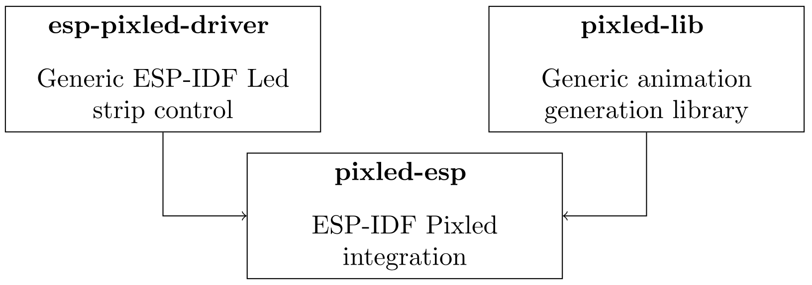

# Pixled ESP :rainbow: :sheep:

`pixled-esp` is an ESP-IDF component that integrates the Pixled animation
library [pixled-lib](https://github.com/pixled/pixled-lib) and the
[esp-pixled-driver](https://github.com/pixled/esp-pixled-driver) led strip
control ESP-IDF component to easily :
1. Build some complex animations using the powerfull Pixled syntax
2. Transmit them to led strips, panels or any other system without struggling
   with low-level hardware issues.



# Installation

This guides assumes that you have already set up your
[ESP-IDF](https://docs.espressif.com/projects/esp-idf/en/latest/esp32/)
environment. Moreover you must know how to build an ESP-IDF project and install an
ESP-IDF component.

As a reminder, to install a component, you can add a `component` folder into the
`$IDF_PATH/components` folder to make it available to any component in any
project, add it locally to your project in your `components` sub-directory or
eventually store it in any custom directory and manually add it to your build
using the `EXTRA_COMPONENT_DIRS` [ESP-IDF project
variable](https://docs.espressif.com/projects/esp-idf/en/latest/esp32/api-guides/build-system.html#optional-project-variables).
(see the ESP-IDF documentation for more information on [component management
](https://docs.espressif.com/projects/esp-idf/en/latest/esp32/api-guides/build-system.html#component-requirements))

**In any case**, the following 3 ESP-IDF components must be available from your
current project :
- [esp-pixled-driver](https://github.com/pixled/esp-pixled-driver)
- [pixled-lib](https://github.com/pixled/pixled-lib)
- [pixled-esp](https://github.com/pixled/pixled-lib) (this repository)

## Installation example

From a terminal with a [loaded ESP-IDF
environment](https://docs.espressif.com/projects/esp-idf/en/latest/esp32/get-started/index.html#step-4-set-up-the-environment-variables),
the following script describes the simplest installation process :
```
cd $IDF_PATH/components
git clone https://github.com/pixled/esp-pixled-driver
git clone https://github.com/pixled/pixled-lib
git clone https://github.com/pixled/pixled-esp
```
and that's it, `pixled-esp` is now available from all your ESP-IDF projects.

# Get started
## Project configuration

Once the `pixled-esp` component is installed, it should be automatically added
as a requirement of the `main` component of your project (see the [ESP-IDF
documentation](https://docs.espressif.com/projects/esp-idf/en/latest/esp32/api-guides/build-system.html#component-requirements)
for more details).

You can then use `#include <pixled_esp.hpp>` to have both an access to the
driver and animation library.

Finally, because the Pixled libraries are written in C++11, you need to :
- use `*.cpp` files (instead of `*.c` files) for the source code that requires
  Pixled (e.g. `main.cpp`)
- wrap your ESP-IDF main function with `extern "C"` as follow :
```cpp
extern "C" void app_main() {
...
}
```

## Sample project

A minimal working `main.cpp` is provided here :
```cpp
#include "freertos/FreeRTOS.h"
#include "freertos/task.h"
#include "pixled_esp.hpp"

#define PIN GPIO_NUM_12
#define NUM_LED 30 

// Brings all pixled classes into scope (recommended)
using namespace pixled;

extern "C" void app_main() {
	// Defines an RGB strip
	RgbStrip strip(PIN, NUM_LED, RMT_CHANNEL_0, WS2812());

	// Binds animation output to the strip
	EspOutput out(strip);

	// Defines a simple strip mapping
	StripMapping mapping(NUM_LED);

	// Sample animation
	auto animation = hsb(RainbowWave(5, 0, 10), 1., .5);

	// Outputs `animation` frames to `out` using `mapping`
	Runtime runtime(mapping, out, animation);

	// TODO : improve this.
	while(1) {
		// Computes next frame
		runtime.next();
		// Transmit data to leds
		strip.show();

		vTaskDelay(50 / portTICK_PERIOD_MS);
	}
}
```
